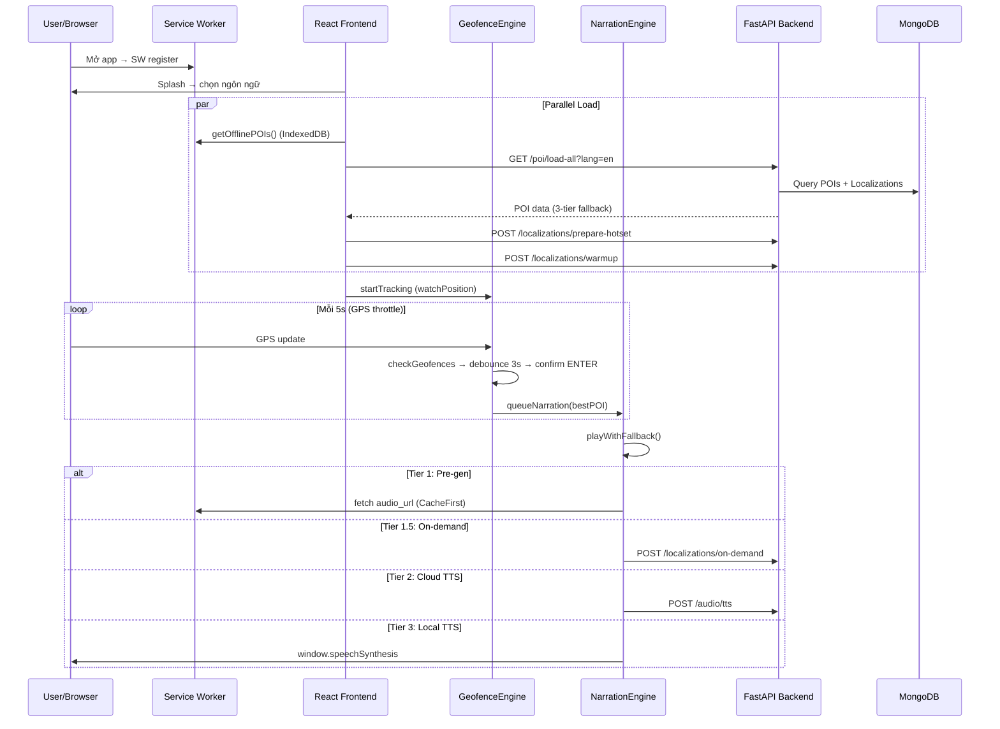
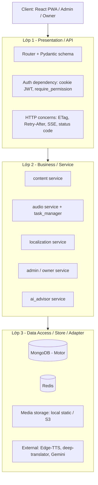

# 🍜 Hệ Thống Du Lịch Ẩm Thực Quận 4 (Quan4 Culinary Tourism)

> Tài liệu tổng hợp từ file `system-presentation-standalone.html` (bản trình bày hệ thống được sinh từ phân tích codebase).
> Mục đích: mô tả đầy đủ yêu cầu, công nghệ, kiến trúc, chức năng và cách vận hành của app.

---

## Mục lục

1. [Giới thiệu & yêu cầu bài toán](#1-giới-thiệu--yêu-cầu-bài-toán)
2. [Công nghệ sử dụng](#2-công-nghệ-sử-dụng)
3. [Kiến trúc tổng quan](#3-kiến-trúc-tổng-quan)
4. [Cơ sở dữ liệu (MongoDB)](#4-cơ-sở-dữ-liệu-mongodb)
5. [Luồng khởi động](#5-luồng-khởi-động)
6. [Chức năng chính](#6-chức-năng-chính)
7. [Xác thực & phân quyền (RBAC)](#7-xác-thực--phân-quyền-rbac)
8. [Đa ngôn ngữ (i18n 2 làn)](#8-đa-ngôn-ngữ-i18n-2-làn)
9. [Offline / PWA](#9-offline--pwa)
10. [Bản đồ & Map Pack](#10-bản-đồ--map-pack)
11. [Admin Dashboard, Owner Portal, AI Advisor](#11-admin-dashboard-owner-portal-ai-advisor)
12. [Design patterns & hằng số quan trọng](#12-design-patterns--hằng-số-quan-trọng)
13. [Luồng end-to-end](#13-luồng-end-to-end-từ-mở-app-đến-nghe-audio)
14. [Chi phí](#14-chi-phí)
15. [Hướng dẫn triển khai / phát triển (gợi ý)](#15-hướng-dẫn-triển-khai--phát-triển-gợi-ý)
16. [Hướng BE Dev: kiến trúc 3 lớp](#16-hướng-be-dev-kiến-trúc-3-lớp)
17. [CI/CD](#17-cicd)

---

# Hướng Dẫn Cài Đặt Môi Trường Ảo Python

Tài liệu này hướng dẫn cách khởi tạo môi trường ảo (virtual environment) và cài đặt các thư viện cần thiết từ file `requirements.txt`.

## Các bước thực hiện

### Bước 1: Tạo môi trường ảo
Mở terminal (hoặc Command Prompt/PowerShell) tại thư mục dự án của bạn và chạy lệnh sau:
```bash
python -m venv venv
```
*Lưu ý: Lệnh này sẽ tạo một thư mục tên là `venv` chứa toàn bộ cấu hình môi trường ảo.*

### Bước 2: Kích hoạt môi trường ảo
Tùy thuộc vào hệ điều hành bạn đang sử dụng, hãy chọn lệnh kích hoạt tương ứng:

*   **Trên Windows (Command Prompt / PowerShell):**
    ```bash
    venv\Scripts\activate
    ```
*   **Trên macOS / Linux:**
    ```bash
    source venv/bin/activate
    ```

> 💡 **Dấu hiệu nhận biết:** Sau khi kích hoạt thành công, bạn sẽ thấy chữ `(venv)` xuất hiện ở đầu dòng lệnh của terminal.

### Bước 3: Cài đặt các thư viện từ `requirements.txt`
Sau khi môi trường ảo đã được kích hoạt, chạy lệnh sau để tự động cài đặt tất cả các gói thư viện được yêu cầu:
```bash
pip install -r requirements.txt
```

---

## Hướng dẫn bổ sung (Khi làm việc xong)

*   **Hủy kích hoạt môi trường ảo:** Khi không muốn làm việc trên môi trường ảo nữa, bạn chỉ cần gõ lệnh:
    ```bash
    deactivate
    ```
*   **Cập nhật file `requirements.txt`:** Nếu bạn có cài đặt thêm thư viện mới và muốn lưu lại vào file, hãy dùng lệnh:
    ```bash
    pip freeze > requirements.txt
    ```
---

## 1. Giới thiệu & yêu cầu bài toán

### 1.1 App là gì?

Một **PWA full-stack** giúp du khách khám phá **ẩm thực đường phố Quận 4, TP.HCM**:

- Bản đồ tương tác hiển thị các điểm ăn uống (POI – Point of Interest).
- **Hướng dẫn âm thanh (audio guide) đa ngôn ngữ** tự động phát khi du khách đi vào vùng quanh quán (geofence).
- **Hoạt động offline** (map, nội dung, hình ảnh, audio đều tải trước được).
- Có cổng quản trị cho **Admin** và cổng riêng cho **chủ quán (Owner)**, kèm **AI** hỗ trợ viết mô tả.

### 1.2 Yêu cầu (suy ra từ hệ thống)

| Nhóm | Yêu cầu |
|---|---|
| **Người dùng cuối (du khách)** | Xem bản đồ + POI gần mình; tự động nghe thuyết minh khi đến gần quán; đổi ngôn ngữ (vi, en, zh, ja, ko và long-tail); dùng được khi mất mạng; không cần đăng nhập |
| **Chủ quán (Owner)** | Đăng ký tài khoản, chờ duyệt; tạo/cập nhật thông tin quán (chờ admin duyệt); nhận thông báo kết quả duyệt; dùng AI cải thiện mô tả (10 lần/ngày) |
| **Admin** | CRUD POI/User/Role/Menu; duyệt đăng ký + bài gửi của owner; xem analytics, audit log; theo dõi tiến trình tạo audio realtime |
| **Phi chức năng** | Chi phí thấp (core open-source); offline-first; bảo mật (httpOnly cookie, RBAC, mã hoá PII); riêng tư (analytics cần consent); chịu lỗi (nhiều tầng fallback) |

---

## 2. Công nghệ sử dụng

### 2.1 Backend

| Công nghệ | Vai trò |
|---|---|
| **FastAPI** | Web framework async (Python) |
| **Motor** | Driver MongoDB bất đồng bộ |
| **MongoDB** | CSDL chính (cần hỗ trợ transaction) |
| **Redis** | Presence, rate-limit analytics, khoá điều phối |
| **Edge-TTS** (Microsoft) | Tạo giọng đọc neural – miễn phí, 300+ voices |
| **deep-translator** (GoogleTranslator) | Dịch văn bản – free tier |
| **Gemini 2.5 Flash / ProxyPal gateway** | AI cải thiện mô tả quán |
| **bcrypt** | Băm mật khẩu |
| **PyJWT** (HS256) | JWT access/refresh token |
| **cryptography (Fernet)** | Mã hoá PII (CCCD chủ quán) |
| S3-compatible storage *(tuỳ chọn)* | Lưu media |

### 2.2 Frontend

| Công nghệ | Vai trò |
|---|---|
| **React 19.2** | UI |
| **Vite 7** (+ PWA plugin) | Build tool |
| **Zustand** | Quản lý state |
| **MapLibre GL JS** | Bản đồ vector |
| **PMTiles** | Tile vector offline, self-host, không cần tile server |
| **Turf.js** | Tính toán không gian (khoảng cách, geofence) |
| **Workbox** (`injectManifest`) | Service Worker |
| **idb** | Bọc IndexedDB (`Quan4DB v2`) |
| `window.speechSynthesis` | TTS cục bộ (fallback cuối) |

### 2.3 Dịch vụ ngoài (tuỳ chọn)

- **MapTiler** – cần `VITE_MAPTILER_KEY` cho chế độ Cloud/Hybrid.
- **Gemini / ProxyPal** – cần API key cho AI Advisor.
- **OpenWeather** – chỉ khi bật weather context cho AI.

### 2.4 Chất lượng / CI

- `frontend/package.json`: `lint:quality` → `build` → `test:node:regressions` / `test:smoke` / `perf:benchmark`.
- GitHub Actions: `.github/workflows/quality.yml`, `perf-smoke.yml`.

---

## 3. Kiến trúc tổng quan

**Mô hình: Modular Monolith** – 9 domain backend chính, **10 router** được mount, dùng chung MongoDB/Redis/static storage nhưng tách boundary theo `router / service / store`.

### 3.1 Mười router (lane) của backend

| Router | Trách nhiệm |
|---|---|
| `content` | CRUD POI, delta sync, hydrate localization, activation gate |
| `audio` | Edge-TTS, GoogleTranslator, task manager, voices, pack manifest |
| `admin` | Cookie auth, RBAC, duyệt đăng ký, audit |
| `owner` | Cổng chủ quán, notification, submissions |
| `ai_advisor` | Gemini 2.5 Flash / ProxyPal, quota 10/ngày cho owner |
| `analytics` | Thu thập có consent, Redis presence, Mongo read models |
| `localization` | On-demand, hotset, warmup, gate "English sẵn sàng" |
| `ui_i18n` | UI bundles, `source_hash`, pending/ready, dịch long-tail |
| `maps` | Manifest static-first, PMTiles, glyphs, sprites, chặn path traversal |
| `runtime_observability` | Ingest vị trí công khai riêng, rate-limit, cửa sổ quan sát cho admin |

Kèm: `/static`, `/health`, `/health/ready`.

### 3.2 Số liệu hệ thống

| Chỉ số | Giá trị |
|---|---|
| Mounted FastAPI routers | 10 |
| Admin + Owner APIs | 52 (40 admin + 12 owner) |
| RBAC permissions | 32 (9 domain) |
| Audio tiers | 4 |
| Content fallback layers | 3 |
| Offline defense layers | 4 |
| Map modes | 3 (Cloud / Offline / Hybrid) |

---

## 4. Cơ sở dữ liệu (MongoDB)

| Collection | Module | Mục đích |
|---|---|---|
| `POI` | content | POI gốc (tiếng Việt), hình ảnh, toạ độ, `trigger_radius` |
| `poi_localizations` | localization | Bản dịch + `audio_url` theo `(poi_id, lang)` – compound index |
| `audio_tasks` | audio | Snapshot/control state task audio, recovery sau restart, heartbeat, TTL |
| `content_dataset_versions` | content | Version token cho `/poi/load-all`, ETag, delta sync cursor |
| `admin_users` | admin | Tài khoản admin/owner, mật khẩu băm, role, `is_poi_owner_verified`, PII mã hoá |
| `roles` | admin | Role động + mảng permission (seed 4 role mặc định) |
| `audit_logs` | admin | Nhật ký hành động (action, user_id, resource, timestamp) |
| `poi_owner_registrations` | admin | Đơn đăng ký chủ quán (pending → approved/rejected) + `admin_note` |
| `poi_submissions` | admin | POI owner tạo/sửa chờ duyệt |
| `owner_notifications` | admin | Thông báo review cho owner (đọc/chưa đọc) |
| `ai_usage_limits` | ai_advisor | Rate limit `{user_id, date, count}`, reset hàng ngày |
| `analytics_*` | analytics | Devices, sessions, events, metrics giờ/ngày, jobs, read models |
| `localization_rate_limits` | localization | Rate limit dùng chung cho dịch/TTS on-demand (TTL) |
| `ui_translation_bundles` | ui_i18n | Cache bundle UI theo namespace + locale + `source_hash` |
| `runtime_location_hourly` | runtime_observability | Read model vị trí theo giờ, tách khỏi analytics consent |
| `MenuItem` | content | Món ăn của từng POI |

---

## 5. Luồng khởi động

### 5.1 Backend (4 tầng)

1. **Security + Bootstrap guard** – kiểm tra `JWT_SECRET`, `REFRESH_TOKEN_SECRET`, `SECRET_KEY` ở môi trường non-dev; validate `SUPERADMIN_BOOTSTRAP_MODE`. Thiếu/sai → **fail-fast**.
2. **DB / Cache / Media readiness** – `connect_db()` → `assert_transaction_capability()` → (tuỳ chọn) `media_storage.check_backend_health()` nếu dùng S3.
3. **Seeding + runtime prep** – `ensure_roles()`, `ensure_super_admin()`, `verify_runtime_storage()` / `ensure_runtime_storage()`.
4. **Recovery + background workers** – refresh transaction readiness, khôi phục audio task sau restart, chạy maintenance loop, đảm bảo index observability, bật `analytics_worker` và `media_cleanup_worker`.
5. Gắn 10 router + `/static` + health endpoints.

### 5.2 Frontend

```
SW Register → React Router (catch-all) → Splash Screen → Chọn ngôn ngữ → Parallel Load
```

Parallel Load gồm:

- 🧭 **Best-effort locate** – ưu tiên vị trí cached còn tốt (budget 15s, cache age 30s, độ chính xác chấp nhận tới 100m).
- 💾 **Offline snapshot** – `getOfflinePOIs(lang)` + UI bundle từ IndexedDB → render ngay cả khi backend chưa phản hồi.
- 🌐 **Delta sync content** – `loadAllPOIs(lang)` dùng ETag, `dataset_version`, `updated_after`.
- 🔥 **Hotset readiness** – `prepare-hotset` lấy tối đa 10 POI gần nhất trong 1.5 km; chỉ coi là sẵn sàng khi **3 POI bắt buộc** đã được cache.
- 🧩 **UI bundle + warmup** – quick-start bằng English trong khi `/warmup` và `/ui-bundles` hoàn tất nền.

**Startup probe:** trước khi kết luận backend lỗi, thử `/api/v1/audio/languages` và `/api/v1/maps/offline-options` với timeout 2.5s, tối đa 2 lần trong cửa sổ 8s.

---

## 6. Chức năng chính

### 6.1 GPS + Geofence + Audio Narration

**4 giai đoạn:**

1. **GPS Collection** (`LocationService`) – `watchPosition()` liên tục, throttle 5s.
2. **Zone Detection** (`GeofenceEngine`) – `turf.distance()`; trong bán kính (mặc định **30m**) → `pendingEntries`; ra ngoài zone đã trigger → cooldown **5 phút**.
3. **Audio Decision** – safety reconcile 5s; xác nhận ENTER sau debounce **3s**; chọn POI theo `audio_priority` rồi theo khoảng cách → đẩy vào `NarrationEngine`.
4. **Audio Playback** – `AudioQueueManager` (hàng đợi ưu tiên 1 slot) → `playWithFallback()`. Kết quả on-demand cũ bị bỏ nếu user đã đổi ngôn ngữ giữa chừng.

**Audio 4 tầng (Hybrid):**

| Tầng | Tên | Độ trễ | Điều kiện / cách hoạt động |
|---|---|---|---|
| 1 | Pre-generated | ~0ms | Có `audio_url`, không `is_fallback` → Service Worker CacheFirst |
| 1.5 | On-demand translate + TTS | 2–5s | `POST /localizations/on-demand` khi POI `is_fallback=true` |
| 2 | Cloud TTS stream | 3–8s | `POST /audio/tts` → Edge-TTS → stream MP3, có disk cache |
| 3 | Local speech synthesis | 0ms | `window.speechSynthesis` – fallback offline cuối cùng |

**Background prefetch:** quét POI `is_fallback=true` trong 500m, enqueue tối đa 3 POI/đợt, đợt mới sau ≥ 30s; gặp 429 thì backoff 30s → 60s → 120s … tối đa 10 phút.

### 6.2 Quản lý nội dung POI

| Endpoint | Chức năng |
|---|---|
| `GET /poi/load-all` | API nặng nhất; full sync hoặc delta sync (`If-None-Match` + `updated_after`); trả `dataset_version`, `sync_mode`, `removed_poi_ids`, `sync_cursor`; chỉ trả POI đã sẵn sàng tiếng Anh |
| `GET /poi/nearby` | Dùng `$geoNear` (index không gian); lỗi thì fallback Haversine in-memory |
| Create/Update POI | Lưu text trước, queue audio cho **5 ngôn ngữ ưu tiên**; đổi mô tả → xoá `audio_url` cũ, `audio_status="processing"`, tạm `is_active=false` |
| Delete POI | Transaction khi có thể, cascade `poi_localizations`, enqueue media cleanup, cập nhật dataset version |

- **Activation gate:** bật public mà chưa có English/audio thì phải regenerate trước.
- **Audio URL decoration:** backend gắn `?v={updated_at}&l={lang}` để cache-bust và để SW chia shard theo ngôn ngữ.
- Giới hạn: tối đa **8 ảnh/POI**, mỗi ảnh ≤ **5 MB**.

**3 tầng fallback nội dung:** `Ngôn ngữ yêu cầu → English → Tiếng Việt nguyên bản` (tầng cuối có `audio_url = null` để frontend chuyển sang on-demand/tier audio khác).

### 6.3 Audio / TTS

- **TTSService:** `translate_text()` (deep-translator) và `generate_audio()` (dịch → Edge-TTS → lưu MP3).
- **Cache key:** `MD5(f"{text}:{lang}")` – file đã tồn tại = Cache HIT, chi phí bằng 0.
- **5 giọng ưu tiên:** vi `HoaiMyNeural`, en `JennyNeural`, zh `XiaoxiaoNeural`, ja `NanamiNeural`, ko `SunHiNeural`.
- **AudioTaskManager:** chạy song song với `Semaphore(3)`; tiến trình realtime qua **SSE** (`GET /admin/audio-tasks/stream`); trạng thái `queued → running → paused → completed/failed/cancelled`; UI có Pause/Resume/Cancel.
- **`GET /audio/pack-manifest`:** quét MP3 theo ngôn ngữ, tính SHA-256 từng file, trả `{lang, pack_version, total_files, total_bytes, files[]}`.

**Pipeline:** `Source Text (VN) → deep-translator → Translated Text → MD5 check → Edge-TTS → MP3 → Upsert Localization`

### 6.4 Analytics & Observability

- Analytics công khai **chỉ chạy sau khi user đồng ý (consent)**.
- `tracked_online_users` = số anonymous device đã consent còn trong sliding window (không phải tổng traffic).
- `runtime_observability` là lane **riêng** cho vị trí, không trộn với analytics consent.

---

## 7. Xác thực & phân quyền (RBAC)

### 7.1 Cookie auth

| Token | Thời hạn | Thuộc tính |
|---|---|---|
| `access_token` (JWT) | 30 phút | httpOnly, SameSite=Lax, Secure |
| `refresh_token` (JWT) | 7 ngày | httpOnly |

- JS không đọc được token (chống XSS); SameSite chống CSRF.
- **Dual-mode:** Cookie (browser) + Bearer header (API/mobile fallback).
- JWT payload chứa permissions → hầu hết request không cần query DB.

### 7.2 Dynamic RBAC

- **Static:** 32 permissions / 9 domain (trong code).
- **Dynamic:** Role lưu trong MongoDB.
- Route guard: `require_permission("poi:delete")`.

**9 domain permission:**

| Domain | Permissions |
|---|---|
| poi | read, create, update, delete, approve, toggle |
| menu | read, create, update, delete |
| user | read, create, update, delete |
| role | read, create, update, delete |
| analytics | view, export, view_own |
| audit | read, manage |
| system | config, logs, backup |
| owner | register, access, submit_poi, manage_own_poi |
| content | moderate, publish |

**4 role mặc định:**

| Role | Priority | Quyền |
|---|---|---|
| `super_admin` | 0 | Tất cả 32 permissions |
| `admin` | 1 | POI/Menu/User + Analytics + Audit + Content |
| `poi_owner` | 10 | `poi:read` + `owner:access/submit_poi/manage_own_poi` + `menu:read/create/update` + `analytics:view_own` |
| `user` | 100 | `poi:read` + `menu:read` + `owner:register` |

### 7.3 Bảo vệ dữ liệu cá nhân (PII)

- Số CCCD chủ quán → `encrypt_pii()` (**Fernet**, tiền tố `v1:`) lưu DB.
- Sau **180 ngày** tự động redacted.
- Decrypt chỉ khi cần, lỗi thì trả `None` (không rò rỉ).

### 7.4 Owner Gate

Ngoài role `poi_owner`, các nghiệp vụ owner còn yêu cầu `is_poi_owner_verified === true`. Chưa xác minh → frontend chỉ cho vào `/owner/registration-status` và màn thông báo.

---

## 8. Đa ngôn ngữ (i18n 2 làn)

| Làn | Nội dung | Cách hoạt động |
|---|---|---|
| **Làn 1 – Content locale** | Nội dung POI | `GET /poi/load-all?lang=ja` hydrate theo `target → English → Vietnamese` |
| Làn 1.1 – Hotset | POI gần | `prepare-hotset` làm nóng ≤ 10 POI trong 1.5km; sẵn sàng khi 3 POI bắt buộc đã cache |
| Làn 1.2 – On-demand + Warmup | Dịch theo yêu cầu / full corpus nền | `POST /localizations/on-demand`, `POST /warmup`; bị chặn thì trả `Retry-After` |
| **Làn 2 – UI bundles** | Chuỗi giao diện | `GET /api/v1/ui-bundles/{locale}`; 5 ngôn ngữ top-level (`en, vi, zh, ja, ko`) có bundle tĩnh; long-tail trả English kèm `status: pending` + `source_hash` trong lúc dịch nền |

> **Điểm mấu chốt:** đổi ngôn ngữ chỉ hoàn tất khi **cả content hotset lẫn UI bundle đều ready**. Trong lúc chờ, app có thể quick-start bằng English.

- Rate limit on-demand: **30 req / 10 phút**.

---

## 9. Offline / PWA

### 4 lớp phòng ngự

**Lớp 1 – Service Worker (Workbox `injectManifest`)**

- POI data: **NetworkFirst** 8s, cache `poi-load-all-cache`, TTL 15 phút.
- Audio: **CacheFirst** theo ngôn ngữ (`audio-cache-lang-{lang}`).
- Images + runtime chunks: CacheFirst, quota-aware purge.
- Map pack: immutable cache riêng + message lane activate/deactivate.

**Lớp 2 – Language sharding + build sync**

- Tối đa **300 file/ngôn ngữ**, **3 ngôn ngữ** đồng thời; LRU xoá ngôn ngữ ít dùng nhất.
- `APP_BUILD_SYNC` dọn optional chunk cache cũ sau mỗi lần deploy.

**Lớp 3 – IndexedDB (`Quan4DB v2`)**

- Lưu `pois_by_lang` và UI bundles.
- Fallback offline: `target → en → vi` (bỏ qua `is_fallback=true` ở lane target). Người dùng không bao giờ thấy màn hình trống.

**Lớp 4 – Offline Packs** (theo ngôn ngữ đang chọn: **map + POI + images + audio**)

- Cài tuần tự: map → POI → images → audio.
- Kiểm tra **SHA-256** từng asset trước khi activate.
- Pack cache tách khỏi runtime cache.
- Trạng thái: `updateAvailable`, `repairRequired`, `poiMissing`.
- `purgeOnQuotaError: true` → hết dung lượng thì hy sinh runtime cache, giữ pack.

### Giao thức message với Service Worker

| Message | Mục đích |
|---|---|
| `SET_ACTIVE_LANGUAGE` | Ghim shard ngôn ngữ đang dùng để eviction ưu tiên giữ đúng |
| `APP_BUILD_SYNC` | Dọn chunk cache cũ sau deploy |
| `AUDIO_PACK_ACTIVATE` | Kích hoạt audio pack |
| `AUDIO_PACK_REMOVE_LANG` | Xoá toàn bộ cache audio của một ngôn ngữ |
| `MAP_PACK_ACTIVATE` | Kích hoạt map pack mới |
| `MAP_PACK_DEACTIVATE` | Xoá PMTiles/style/font cache, quay về cloud |

Nếu remote manifest lỗi liên tục, lane kiểm tra update tự vào **cooldown** để không spam network.

---

## 10. Bản đồ & Map Pack

### 3 chế độ

| Chế độ | Mô tả |
|---|---|
| ☁️ **Cloud** (mặc định) | Style template của dự án, glyphs tự host, cần `VITE_MAPTILER_KEY` |
| 📦 **Offline Pack** | PMTiles + style/glyphs local, theo scope (Quận 4 / TP.HCM), đọc từ Cache API sau khi verify |
| 🔄 **Hybrid Q4** | Cloud-first, tự chuyển sang pack local khi cloud lỗi/offline; quay lại cloud có độ trễ để tránh flip-flop |

### Chuỗi 4 tầng

1. **Mode selection** – `mapConfig.js`.
2. **Pack publication** – `/static/maps/*` (chính) + `/api/v1/maps/*` (tương thích); manifest có version, checksum, scope, source_date, bbox.
3. **Pack activation** – tải, verify SHA-256, safe/replace update, rồi mới activate.
4. **Runtime rendering** – MapLibre + `pmtiles://`.

### Endpoint maps

| Endpoint | Cache |
|---|---|
| `GET /static/maps/packs/current/manifest.json` / `GET /api/v1/maps/offline-manifest` | no-cache |
| `GET /api/v1/maps/offline-options` | no-cache |
| `GET /static/maps/packs/{version}/{file}.pmtiles` (Range Requests) | immutable |
| `GET /static/maps/styles/*.json` | revalidate / immutable |
| `GET /static/maps/fonts/{fontstack}/{range}.pbf` | immutable |

**Bảo mật:** `resolve_safe_path(base, relative)` – mọi đường dẫn phải nằm trong base dir, chặn Path Traversal. Thư mục dữ liệu: `backend/app/static/maps/` (override bằng env `MAP_PACK_DATA_DIR`).

---

## 11. Admin Dashboard, Owner Portal, AI Advisor

### 🏪 Owner Portal (B2B)

- Đăng ký public: `POST /admin/auth/register-owner`.
- Admin duyệt → `is_verified=true` + `is_poi_owner_verified=true`.
- Quản lý quán của mình: `PUT /owner/pois/{id}`.
- Submissions chờ admin phê duyệt mới lên app (ghi chú dùng field `admin_note`).
- Notification bell + trang chi tiết: `/owner/notifications*`.

**Luồng đăng ký:**

```
Chủ quán đăng ký → tạo user (poi_owner, unverified) → tạo poi_owner_registrations (pending)
→ Admin duyệt → user verified → Owner login → /owner
```

### 🎛️ Admin Dashboard (40 admin routes + 12 owner = 52)

- CRUD: POIs, Users, Roles, Menus.
- Kiểm duyệt: Registrations, Submissions.
- Auth: `/admin/auth/me`, `POST /admin/auth/change-password`.
- Giám sát: analytics read models, audit logs, runtime observability window.
- SSE: tiến trình audio task realtime.

### 🤖 AI Advisor (Gemini 2.5 Flash / ProxyPal)

- `GET /ai/usage`, `POST /ai/enhance-description`.
- Prompt: **không bịa**, được thêm tính từ tích cực, viết 200–300 từ.
- Rate limit: Owner **10/ngày** (`OWNER_DAILY_LIMIT`), Admin không giới hạn.
- Timeout 30s, báo lỗi theo provider rõ ràng cho UI.

---

## 12. Design patterns & hằng số quan trọng

### Patterns

| Pattern | Mô tả |
|---|---|
| Modular Monolith | 9 domain, 10 router, tách boundary router/service/store |
| 4-Tier Hybrid Audio | Pre-gen → On-demand → Cloud TTS → Local TTS |
| 3-Tier Content Fallback | Target → English → Vietnamese |
| Dual-Lane i18n | Content locale và UI bundle warm riêng |
| Language Sharding | SW cache theo ngôn ngữ + LRU + ghim ngôn ngữ active |
| Geofence Reconciliation | Reconcile 5s, debounce 3s, cooldown 5 phút |
| Dynamic RBAC | Permission tĩnh (code) + Role động (DB) |
| Consent-Gated Analytics | Chỉ ghi nhận khi user đồng ý |
| httpOnly Cookie Auth | Chống XSS, SameSite chống CSRF |
| Offline-First PWA | SW + IndexedDB + Cache API + PMTiles |
| SSE Progress Tracking | Task audio snapshot Mongo + EventSource |
| PII Encryption at Rest | Fernet + tự redact sau 180 ngày |

### Hằng số

| Hằng số | Giá trị |
|---|---|
| ACCESS_TOKEN_EXPIRE | 30 phút |
| REFRESH_TOKEN_EXPIRE | 7 ngày |
| VOICE_CATALOG_TTL | 6 giờ |
| MAX_CONCURRENT_TTS | 3 |
| AUDIO_TASK_HEARTBEAT | 5 giây |
| AUDIO_TASK_STALE_AFTER | 5 phút |
| AUDIO_TASK_RETENTION | 14 ngày |
| PII_RETENTION_DAYS | 180 ngày |
| MAX_POI_IMAGES / MAX_IMAGE_SIZE | 8 / 5 MB |
| ON_DEMAND_RATE_LIMIT | 30 req / 10 phút |
| HOTSET_MAX_POI_IDS / REQUIRED_CACHE_COUNT | 10 / 3 |
| OWNER_DAILY_LIMIT | 10 |
| STARTUP_PROBE_WINDOW / MAX_FAILS | 8 giây / 2 |
| GPS Throttle | 5s |
| Locate request budget / max cached age | 15s / 30s |
| Geofence debounce / radius / cooldown / reconcile | 3s / 30m / 5 phút / 5s |
| Prefetch queue | Top 3/đợt, cách ≥ 30s |
| Hotset nearby radius | 1500m |
| POI cache TTL | 15 phút |
| Audio max per lang / Max language caches | 300 / 3 |
| IndexedDB | `Quan4DB v2` |

---

## 13. Luồng end-to-end (từ mở app đến nghe audio)



---

## 14. Chi phí

| Thành phần | Chi phí |
|---|---|
| Edge-TTS (300+ giọng) | ✅ Miễn phí |
| deep-translator (Google Translate free) | ✅ Miễn phí |
| PMTiles (self-host) | ✅ Không cần tile server |
| MapLibre | ✅ Open-source |
| Workbox | ✅ Open-source |
| Gemini / ProxyPal | ⚠️ Cần API key, quota 10 lượt/ngày cho owner |
| MapTiler | ⚠️ Chỉ cần key cho Cloud/Hybrid |
| OpenWeather | ⚠️ Chỉ khi bật weather context cho AI |

→ **Core $0**, chỉ trả phí cho các tính năng tuỳ chọn. Chi phí hạ tầng (server, MongoDB, Redis, lưu trữ) vẫn phát sinh khi deploy.

---

## 15. Hướng dẫn triển khai / phát triển (gợi ý)

> ⚠️ File trình bày gốc **không chứa lệnh cài đặt cụ thể hay cấu trúc thư mục đầy đủ**. Phần này chỉ là hướng dẫn gợi ý dựa trên stack và biến môi trường được nhắc đến. Hãy đối chiếu với `README` / `package.json` / `requirements.txt` trong repo thật.

### 15.1 Yêu cầu môi trường

- Python 3.10+ (FastAPI, Motor, Edge-TTS…)
- Node.js 18+ (Vite 7, React 19)
- MongoDB (bật **replica set** vì app kiểm tra `assert_transaction_capability()`)
- Redis
- Dung lượng lưu trữ cho `static/` (map pack, audio MP3, ảnh)

### 15.2 Biến môi trường được nhắc đến

| Biến | Dùng cho |
|---|---|
| `JWT_SECRET`, `REFRESH_TOKEN_SECRET`, `SECRET_KEY` | Bắt buộc ở non-dev, thiếu là backend không chạy |
| `SUPERADMIN_BOOTSTRAP_MODE` | Chế độ tạo super admin lần đầu |
| `MAP_PACK_DATA_DIR` | Override thư mục map pack |
| `VITE_MAPTILER_KEY` | Frontend – cloud/hybrid map |
| API key Gemini / ProxyPal | AI Advisor |
| Khoá Fernet cho PII | Mã hoá CCCD *(tên biến chưa nêu trong tài liệu)* |
| Cấu hình S3-compatible | Tuỳ chọn, lưu media |

### 15.3 Quy trình gợi ý

```bash
# 1. Backend
cd backend
python -m venv .venv && source .venv/bin/activate
pip install -r requirements.txt
# cấu hình .env (secrets, MongoDB, Redis...)
uvicorn app.main:app --reload

# 2. Frontend
cd frontend
npm install
npm run dev            # phát triển
npm run lint:quality   # kiểm tra chất lượng
npm run build          # build production (PWA)
npm run test:smoke     # smoke test
```

### 15.4 Kiểm tra sau khi chạy

- `GET /health` và `GET /health/ready` trả OK.
- Đăng nhập super admin → tạo POI → xem audio task chạy qua SSE.
- Mở app, chọn ngôn ngữ, bật định vị → đứng gần POI để thử geofence + audio.
- Tắt mạng → app vẫn hiển thị POI từ IndexedDB/Service Worker.
- Cài Offline Pack (map + POI + images + audio) rồi thử lại ở chế độ máy bay.

---

## 16. Hướng BE Dev: kiến trúc 3 lớp

> **Cách đọc phần này:** hệ thống gốc đã tách boundary theo `router / service / store` trong từng domain (xem mục 3). Đây chính là mô hình 3 lớp. Phần dưới hệ thống hoá lại thành quy ước cho BE dev. Tên file như `content/service.py`, `audio/task_manager.py`, `audio/task_store.py`, `main.py` lấy từ tài liệu gốc. Cấu trúc thư mục chi tiết và đoạn code mẫu là **đề xuất**, hãy đối chiếu với repo thật.

### 16.1 Sơ đồ 3 lớp



**Quy tắc phụ thuộc:** chỉ gọi xuống dưới (`Router → Service → Store`). Lớp dưới không import lớp trên. Không gọi nhảy cóc (router không chạm Mongo trực tiếp).

### 16.2 Trách nhiệm từng lớp

| Lớp | Làm | Không làm | Ví dụ trong hệ thống |
|---|---|---|---|
| **1. Presentation (router)** | Nhận request, validate schema, kiểm quyền (`require_permission("poi:delete")`), map exception → HTTP status, set header | Không chứa logic nghiệp vụ, không query DB | `GET /poi/load-all` xử lý `If-None-Match` và trả ETag; `Retry-After` khi bị rate-limit; SSE `/admin/audio-tasks/stream` |
| **2. Business (service)** | Quy tắc nghiệp vụ, điều phối nhiều store, quản lý transaction, gọi provider ngoài qua adapter | Không biết HTTP (`Request`/`Response`), không viết query thô | Activation gate (bật public phải có English + audio), fallback `target → en → vi`, delta sync, quota AI 10/ngày, hotset 10 POI/1.5km |
| **3. Data access (store/adapter)** | Truy vấn Mongo/Redis, đọc ghi file media, bọc API bên ngoài | Không chứa quy tắc nghiệp vụ | `audio/task_store.py` (snapshot task, TTL 14 ngày), `$geoNear` kèm fallback Haversine, Edge-TTS, Gemini/ProxyPal, S3 |

**Cross-cutting (dùng chung, không thuộc lớp nào):** config và kiểm tra secret, JWT/bcrypt/Fernet, audit log, rate limit, logging, `resolve_safe_path`, các background worker (`analytics_worker`, `media_cleanup_worker`, audio maintenance loop).

### 16.3 Cấu trúc thư mục đề xuất

```text
backend/
├── app/
│   ├── main.py                  # lifespan(): validate secret, connect DB, seed, start workers, mount routers
│   ├── core/                    # config, security (jwt, hashing, fernet), deps, exceptions, logging
│   ├── content/
│   │   ├── router.py            # Lớp 1
│   │   ├── schemas.py           # request/response models
│   │   ├── service.py           # Lớp 2
│   │   └── store.py             # Lớp 3
│   ├── audio/                   # router, service (TTSService), task_manager, task_store
│   ├── localization/            # router, service, store
│   ├── ui_i18n/
│   ├── admin/                   # auth, RBAC, registrations, submissions, audit
│   ├── owner/
│   ├── ai_advisor/
│   ├── analytics/
│   ├── maps/
│   ├── runtime_observability/
│   └── static/                  # maps, audio, images
├── tests/
│   ├── unit/                    # test service với store giả (mock)
│   ├── integration/             # test store với Mongo/Redis thật
│   └── api/                     # test router qua TestClient
├── Dockerfile
├── requirements.txt
└── .env.example
```

### 16.4 Ví dụ một luồng xuyên 3 lớp (đề xuất): xoá POI

```python
# ---------- Lớp 1: content/router.py ----------
@router.delete("/admin/pois/{poi_id}", status_code=204)
async def delete_poi(
    poi_id: str,
    user = Depends(require_permission("poi:delete")),
    service: ContentService = Depends(get_content_service),
):
    await service.delete_poi(poi_id, actor=user)       # chỉ ủy quyền, không logic

# ---------- Lớp 2: content/service.py ----------
class ContentService:
    def __init__(self, poi_store, loc_store, version_store, media_cleanup, audit):
        ...

    async def delete_poi(self, poi_id: str, actor) -> None:
        async with self.poi_store.transaction() as session:   # quản lý transaction ở service
            poi = await self.poi_store.get(poi_id, session=session)
            if not poi:
                raise NotFoundError("POI không tồn tại")
            await self.poi_store.delete(poi_id, session=session)
            await self.loc_store.delete_by_poi(poi_id, session=session)   # cascade
            await self.version_store.touch(session=session)               # đổi dataset_version
        await self.media_cleanup.enqueue(poi)                              # dọn media sau commit
        await self.audit.log("poi:delete", actor.id, poi_id)

# ---------- Lớp 3: content/store.py ----------
class PoiStore:
    async def get(self, poi_id, session=None):
        return await self.col.find_one({"_id": poi_id}, session=session)
    async def delete(self, poi_id, session=None):
        await self.col.delete_one({"_id": poi_id}, session=session)
```

Điểm cần nhớ khi code theo hướng này:

- `NotFoundError`, `ForbiddenError`… là exception nghiệp vụ; **router/handler chung** mới map sang HTTP 404/403.
- Service nhận store qua constructor (dependency injection của FastAPI `Depends`) để dễ mock khi test.
- Transaction đặt ở **service** vì đó là ranh giới nghiệp vụ. Hệ thống gốc đã yêu cầu `assert_transaction_capability()` ở startup, nên MongoDB phải chạy replica set.

### 16.5 Áp dụng 3 lớp cho các domain khó

| Domain | Lớp 1 | Lớp 2 | Lớp 3 |
|---|---|---|---|
| **Audio TTS** | `POST /audio/tts`, SSE stream | `TTSService`, `AudioTaskManager` (Semaphore 3, pause/resume/cancel, recovery) | `task_store`, file MP3 (cache key MD5), Edge-TTS adapter |
| **Localization** | `on-demand`, `prepare-hotset`, `warmup` | Hotset, rate limit 30 req/10 phút, gate "English ready" | `poi_localizations`, `localization_rate_limits`, dịch qua deep-translator |
| **Auth/RBAC** | login, refresh, `/auth/me` | Cấp JWT, kiểm role/permission, owner gate | `admin_users`, `roles`, `audit_logs`, Fernet cho PII |
| **AI Advisor** | `/ai/usage`, `/ai/enhance-description` | Quota theo ngày, dựng prompt, fallback provider | `ai_usage_limits`, Gemini/ProxyPal client |
| **Maps** | `/static/maps/*`, `/api/v1/maps/*` | Chọn manifest, danh sách pack | File PMTiles, `resolve_safe_path` |

### 16.6 Chiến lược test theo lớp

| Lớp | Loại test | Công cụ gợi ý | Mục tiêu |
|---|---|---|---|
| Service | Unit, store/adapter giả | `pytest`, `pytest-asyncio` | Phủ cao nhất: fallback, activation gate, quota, RBAC |
| Store | Integration với Mongo (replica set) + Redis thật | `pytest` + container service | Index, `$geoNear`, transaction, TTL |
| Router | API test | FastAPI `TestClient`/`httpx` | Schema, status code, ETag/304, cookie auth |
| Toàn hệ thống | Smoke, perf | Script smoke, benchmark | `/health/ready`, `/poi/load-all` |

### 16.7 Checklist khi thêm một tính năng mới

1. Tạo schema request/response (lớp 1).
2. Viết hàm store tối thiểu, thêm index nếu cần (lớp 3).
3. Viết service chứa nghiệp vụ, transaction, audit (lớp 2).
4. Viết router mỏng, gắn `require_permission` đúng permission (lớp 1).
5. Nếu thêm permission mới: cập nhật danh sách permission tĩnh và seed role (`ensure_roles()`).
6. Viết test cho service trước, rồi store, rồi router.
7. Nếu đổi dữ liệu POI công khai: nhớ cập nhật `content_dataset_versions` để delta sync hoạt động.
8. Cập nhật tài liệu API và `.env.example` nếu thêm biến môi trường.

---

## 17. CI/CD

> **Hiện trạng theo tài liệu gốc:** repo đã có `.github/workflows/quality.yml` và `perf-smoke.yml`; pipeline chất lượng frontend là `lint:quality → build → test:node:regressions / test:smoke / perf:benchmark`. Tài liệu gốc **không mô tả** phần CD (đóng gói, deploy). Phần CD và workflow cho backend bên dưới là **đề xuất thiết kế**.

### 17.1 Tổng quan pipeline

```mermaid
flowchart LR
    A[Push / Pull Request] --> B[CI: lint + type check]
    B --> C[Unit test]
    C --> D[Integration test: Mongo replica set + Redis]
    D --> E[Security scan]
    E --> F[Build Docker image]
    F -->|merge vào main| G[Push registry]
    G --> H[Deploy staging]
    H --> I[Smoke test /health/ready]
    I -->|duyệt thủ công| J[Deploy production]
    J --> K[Smoke test + theo dõi]
    K -->|lỗi| L[Rollback bản trước]
```



### 17.2 CI (chạy trên mỗi PR)

| Bước | Nội dung | Công cụ gợi ý |
|---|---|---|
| 1. Lint & format | Kiểm tra style, import | `ruff`, `black --check` |
| 2. Type check | Kiểm tra kiểu | `mypy` (tuỳ chọn) |
| 3. Unit test | Test lớp service bằng store giả | `pytest` |
| 4. Integration test | Test store/router với Mongo **replica set** + Redis | service container |
| 5. Security | Quét dependency và secret rò rỉ | `pip-audit`, `gitleaks` |
| 6. Build | Build Docker image để chắc chắn đóng gói được | `docker build` |
| 7. Frontend (có sẵn) | `lint:quality` → `build` → `test:node:regressions`, `test:smoke`, `perf:benchmark` | `quality.yml`, `perf-smoke.yml` |

**Quy tắc merge:** bật branch protection, bắt buộc CI xanh và ít nhất 1 review.

### 17.3 Ví dụ workflow CI backend (đề xuất)

```yaml
# .github/workflows/backend-ci.yml
name: backend-ci
on:
  pull_request:
    paths: ["backend/**"]
  push:
    branches: [main]
    paths: ["backend/**"]

jobs:
  test:
    runs-on: ubuntu-latest
    defaults: { run: { working-directory: backend } }
    services:
      mongo:
        image: mongo:7
        ports: ["27017:27017"]
        options: >-
          --health-cmd "mongosh --quiet --eval 'db.runCommand({ping:1})'"
          --health-interval 10s --health-retries 5
      redis:
        image: redis:7
        ports: ["6379:6379"]
    env:
      MONGO_URL: mongodb://localhost:27017/?replicaSet=rs0
      REDIS_URL: redis://localhost:6379/0
      JWT_SECRET: ci-only-secret
      REFRESH_TOKEN_SECRET: ci-only-refresh
      SECRET_KEY: ci-only-key
    steps:
      - uses: actions/checkout@v4
      - uses: actions/setup-python@v5
        with: { python-version: "3.11", cache: pip }
      - run: pip install -r requirements.txt pytest pytest-asyncio ruff pip-audit
      - run: ruff check .
      - run: pip-audit -r requirements.txt
      # Mongo trong CI cần khởi tạo replica set để transaction hoạt động:
      - run: |
          docker exec $(docker ps -qf ancestor=mongo:7) \
            mongosh --eval 'rs.initiate({_id:"rs0",members:[{_id:0,host:"localhost:27017"}]})'
      - run: pytest tests/unit tests/api
      - run: pytest tests/integration
```

> Lưu ý: việc khởi tạo replica set trong service container cần điều chỉnh theo cách chạy Mongo (ví dụ chạy với `--replSet rs0`). Hãy kiểm thử workflow trên repo thật.

### 17.4 CD (đề xuất)

**Đóng gói bằng Docker:**

```dockerfile
# backend/Dockerfile
FROM python:3.11-slim
WORKDIR /app
COPY requirements.txt .
RUN pip install --no-cache-dir -r requirements.txt
COPY app ./app
EXPOSE 8000
HEALTHCHECK CMD python -c "import urllib.request as u; u.urlopen('http://localhost:8000/health')"
CMD ["uvicorn", "app.main:app", "--host", "0.0.0.0", "--port", "8000"]
```

**Workflow deploy (khung):**

```yaml
# .github/workflows/backend-cd.yml
name: backend-cd
on:
  push:
    branches: [main]
    paths: ["backend/**"]

jobs:
  build-push:
    runs-on: ubuntu-latest
    permissions: { contents: read, packages: write }
    steps:
      - uses: actions/checkout@v4
      - uses: docker/login-action@v3
        with:
          registry: ghcr.io
          username: ${{ github.actor }}
          password: ${{ secrets.GITHUB_TOKEN }}
      - uses: docker/build-push-action@v6
        with:
          context: backend
          push: true
          tags: ghcr.io/${{ github.repository }}/api:${{ github.sha }}

  deploy-staging:
    needs: build-push
    runs-on: ubuntu-latest
    environment: staging
    steps:
      - run: echo "Deploy image :${{ github.sha }} lên staging (SSH/compose/k8s tuỳ hạ tầng)"
      - run: |
          for i in {1..12}; do
            curl -fsS https://staging.example.com/health/ready && exit 0
            sleep 5
          done
          exit 1

  deploy-production:
    needs: deploy-staging
    runs-on: ubuntu-latest
    environment: production      # cấu hình "required reviewers" để duyệt tay
    steps:
      - run: echo "Deploy cùng image đã test ở staging"
      - run: curl -fsS https://api.example.com/health/ready
```

**Nguyên tắc CD:**

- **Build một lần, deploy nhiều nơi:** cùng một image (tag = commit SHA) đi qua staging rồi production.
- **Dùng `/health/ready` làm readiness check:** endpoint này đã có sẵn, và startup đã fail-fast nếu thiếu secret hoặc Mongo không hỗ trợ transaction, nên deploy lỗi cấu hình sẽ không nhận traffic.
- **Secrets** đặt trong GitHub Environments/secret manager, không commit: `JWT_SECRET`, `REFRESH_TOKEN_SECRET`, `SECRET_KEY`, khoá Fernet, API key Gemini/MapTiler.
- **Rollback:** giữ vài image gần nhất, rollback bằng cách deploy lại tag trước.

### 17.5 Những điểm riêng của hệ thống này cần lưu ý khi triển khai

| Vấn đề | Lý do | Gợi ý xử lý |
|---|---|---|
| MongoDB phải hỗ trợ transaction | Startup gọi `assert_transaction_capability()`; xoá POI dùng transaction | Dùng replica set ở mọi môi trường, kể cả CI |
| Thiếu secret → app không chạy | Fail-fast ở non-dev | Kiểm tra secret trong bước deploy trước khi chạy |
| Seed chạy mỗi lần khởi động | `ensure_roles()`, `ensure_super_admin()` | Giữ các hàm này idempotent; kiểm tra `SUPERADMIN_BOOTSTRAP_MODE` trên production |
| Dữ liệu tĩnh lớn | Map pack PMTiles, audio MP3, ảnh nằm ở `static/` | Dùng volume bền vững hoặc S3-compatible; không bake vào image; phục vụ Range Request qua CDN/reverse proxy |
| Audio task đang chạy khi redeploy | Task có heartbeat 5s, stale sau 5 phút, có `recover_after_restart()` | Cho phép graceful shutdown; sau deploy kiểm tra task được khôi phục |
| Background worker khi chạy nhiều instance | Mỗi instance đều khởi động `analytics_worker`, `media_cleanup_worker`, maintenance loop *(suy luận từ lifespan, cần xác nhận trong code)* | Kiểm tra cơ chế khoá/leader trước khi scale ngang, hoặc tách worker thành service riêng |
| Frontend và backend lệch phiên bản | Delta sync và Service Worker phụ thuộc hợp đồng API | Deploy backend tương thích ngược trước, frontend sau; `APP_BUILD_SYNC` dọn cache cũ sau deploy |
| Cache bản đồ/audio | Asset `immutable`, manifest `no-cache` | Version hoá tên file; không ghi đè file cũ |

### 17.6 Lộ trình áp dụng đề xuất

1. **Tuần 1:** hoàn thiện CI backend (lint, unit test, integration có Mongo replica set).
2. **Tuần 2:** thêm Dockerfile, build và push image lên registry.
3. **Tuần 3:** môi trường staging, tự động deploy kèm smoke test `/health/ready`.
4. **Tuần 4:** production có bước duyệt tay, quy trình rollback, cảnh báo/giám sát.

---

*Tài liệu được tổng hợp từ bản presentation của hệ thống. Các con số và tên thành phần lấy nguyên từ nguồn; phần 15, 16 (ví dụ code, cấu trúc thư mục) và 17 (CD) là đề xuất bổ sung.*
